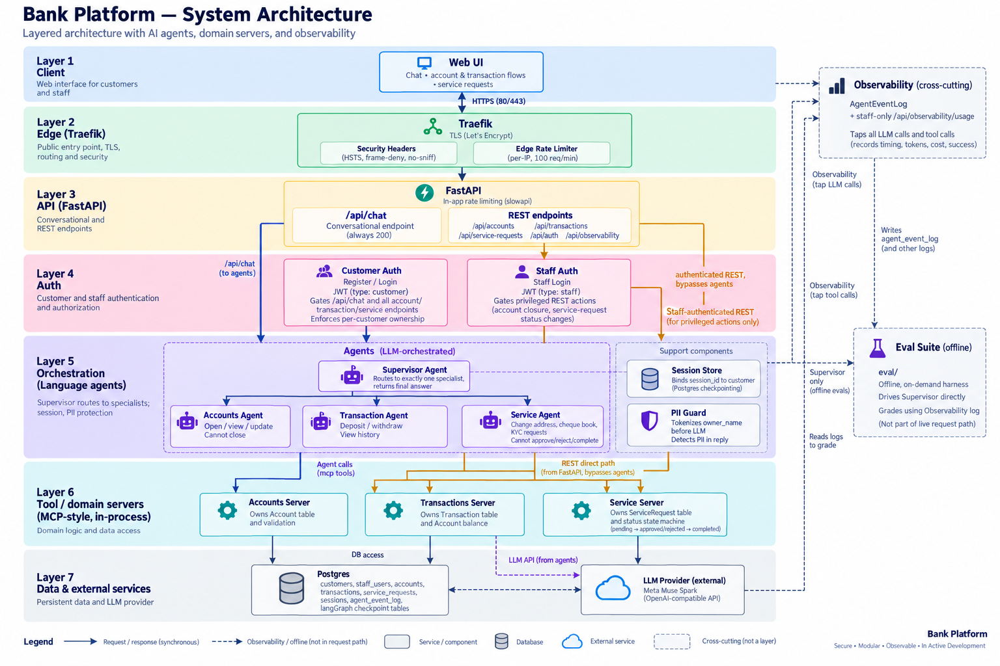

# Bank Platform

A multi-agent banking assistant: a chat interface backed by a LangGraph
supervisor that routes each request to a specialist agent, plus a full
deterministic REST API alongside it.

## Agents

A **supervisor** agent routes every `/chat` message to exactly one of
three specialists, each bound only to its own domain's tools, and relays
the final answer back verbatim — the customer never sees that a
multi-agent system exists underneath.

- **Accounts agent** — open an account, view details/balance, update
  owner name or balance. Cannot close an account (staff-only, not
  agent-accessible).
- **Transaction agent** — deposits, withdrawals, transaction history.
  Money math uses `Decimal`, never `float`.
- **Service agent** — change-of-address, cheque book, and KYC requests.
  Approving/rejecting a request is staff-only, not something a customer
  (or the agent acting for them) can do to themselves.

Each agent talks to its domain through its own MCP-style server
(`accounts_server.py` / `transactions_server.py` / `service_server.py`),
which owns that domain's validation and invariants — the agents
themselves never touch the database directly. Conversations persist
per-`session_id` across turns (LangGraph's Postgres checkpointer), and a
`session_id` is bound to whichever customer first uses it so two
customers can never share one thread.

The LLM (currently Meta's Muse Spark) is provider-swappable — see
`llm.py` and `PROBLEMS.md` for the evaluation trail across providers.

## Auth & authorization

Customers register/log in with a password (JWT, bcrypt-hashed) and can
only ever see or act on accounts they own — enforced identically whether
the request comes through `/chat` or the REST API. Staff have a separate
login and are the only ones who can close an account or approve a
service request.

## API

Every domain also has a plain REST surface (`/api/accounts`,
`/api/transactions`, `/api/service-requests`, ...) that bypasses the LLM
entirely for deterministic reads/writes with real HTTP status codes —
`/chat` isn't the only way in.

## Observability & evaluation

Every LLM/tool call is logged (timing, token usage, estimated cost, no
raw content) and queryable via a staff-only usage endpoint. A separate
on-demand suite (`eval/`) grades the live model's actual routing/tool-call
behavior against real scenarios — kept outside the normal test run since
it costs real API calls.

## Deployment

Containerized (Docker) and fronted by Traefik (TLS, security headers,
edge rate limiting) for a self-managed deployment; the AWS EC2 target is
provisioned as code via Terraform (`infra/`). See `CLAUDE.md`'s
"Deploying" section for specifics.

## Stack

Python 3.13+, FastAPI, SQLAlchemy 2.0 + Postgres, LangGraph/LangChain,
`uv` for dependencies, `pytest` (no mocking — real DB).

See [`CLAUDE.md`](CLAUDE.md) for architecture/conventions, and
[`PROGRESS.md`](PROGRESS.md) for what's built vs. in progress.
